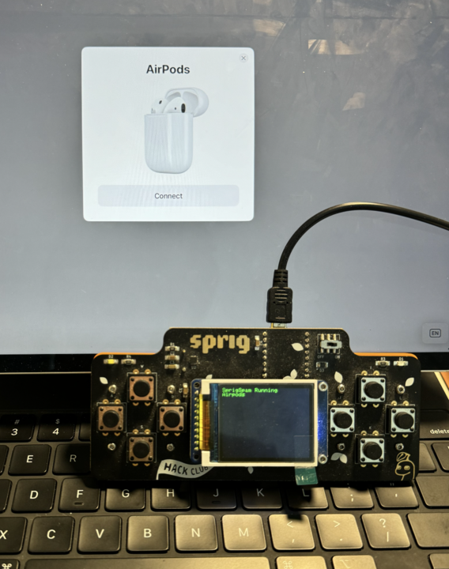

# SprigSpam
A kind of port of AppleJuice, to Sprig.
This program can do... this:

A Arduino program for [Hack Club's Sprig game console](https://github.com/hackclub/sprig).

Thank you to [AppleJuice](https://github.com/ECTO-1A/AppleJuice), this project takes from AppleJuice's information.

You'll need a Pico W(or WH, not H), because this program uses the BLE functions.

Basic usage:
Put the Pico in bootloader mode with the BOOTSEL button, wait until the drive appears,
Upload the sprigSpamArduino.ino.uf2 file to the Pico.
Wait for the sprig screen to display stuff.

Controls:\
W: Select Up\
A: N/A\
S: Select Down\
D: Start/Stop\

Build it yourself:\
Install this Arduino core: [Arduino-Pico core](https://arduino-pico.readthedocs.io/en/latest/install.html#installing-via-arduino-boards-manager)\
Select an option with bluetooth.\

Notes and random things:\
D button for start stop, give credit to KittyCat and HenHen.\

Todo:\
Button classes\
Better menu\
ChromeOS pair spamming.\

Bugs:
Fix array later
